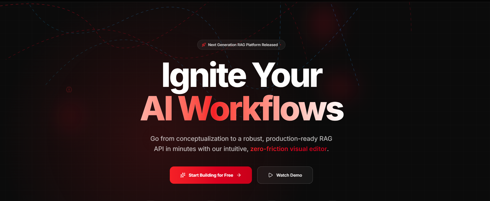
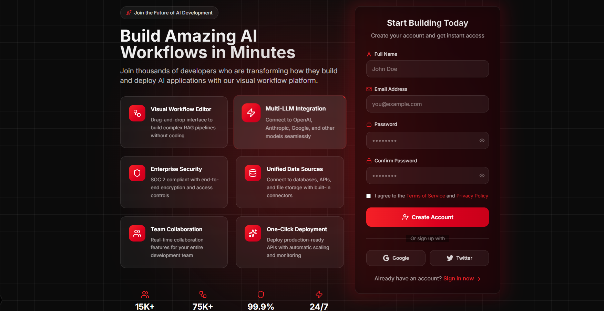
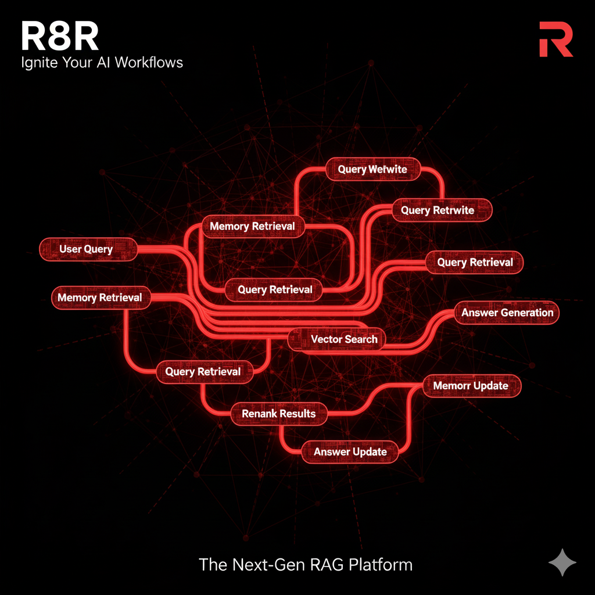

# ⚡ R8R - Rapid RAG Runtime


---

## 🧠 Revolutionizing RAG Development

**R8R** is an enterprise-grade **RAG Workflow-as-a-Service** platform that transforms complex, multi-LLM retrieval pipelines into **simple API calls**.  
Stop building RAG systems from scratch — deploy intelligent retrieval workflows in **minutes, not weeks**.

---

## 🎯 What is R8R?

**R8R (Rapid RAG Runtime)** provides **pre-built, optimized RAG workflows** accessible via REST API.  
We handle everything — **query rewriting, hybrid retrieval, memory persistence, multi-LLM orchestration, and verification** — so you can focus on building amazing AI products.

---

## 🖼️ Platform Preview

<div align="center">

### 🌐 Landing Page - Modern & Engaging

<p><em>Clean, professional landing page showcasing R8R's value proposition and features</em></p>

### 🔐 Signup & Authentication

<p><em>Secure signup process with instant API key generation</em></p>

### 🧩 Visual Workflow Editor

<p><em>Drag-and-drop node-based workflow builder for RAG pipelines</em></p>

</div>

---

## 🚨 The Problem We Solve

❌ Building production-grade RAG systems takes **4–8 weeks**  
❌ Managing **multiple LLMs and vector DBs** is painful  
❌ Query rewriting, hybrid retrieval & synthesis need **deep tuning**  
❌ Most teams **reinvent the wheel** for every new use case  

---

## 💡 Our Solution

✅ **API-first RAG Workflows** — Deploy in under 5 minutes  
🧠 **Multi-LLM Intelligence** — Smart routing, fallback & consensus  
🔍 **Query Optimization Engine** — Automatic rewriting & context expansion  
🧩 **Visual Workflow Editor** — Build, chain & deploy nodes instantly  
💬 **Telegram Workflow Builder (In Progress)** — Create and manage RAG workflows directly from Telegram:  
```bash
/create_workflow Build a document summarizer using vector embeddings
R8R instantly creates your RAG pipeline and replies with your API key — no website needed!

🧠 Persistent Memory System — R8R remembers context, improves retrieval quality, and learns from past user queries (currently under testing — showing great results 🚀)

⚡ Quick Start
1️⃣ Get Your API Key
bash
Copy code
# Sign up at https://r8r.ai
# Free plan includes 1000 queries/month
2️⃣ Make Your First Query
javascript
Copy code
import R8R from 'r8r-client';

const client = new R8R('your-api-key');

const result = await client.query(
  "What are the latest treatments for type 2 diabetes?",
  {
    pipeline: 'advanced',
    sources: ['medical_journals', 'clinical_guidelines']
  }
);

console.log(result.answer);
3️⃣ Use REST API
bash
Copy code
curl -X POST https://api.r8r.ai/v1/query \
  -H "Authorization: Bearer YOUR_API_KEY" \
  -H "Content-Type: application/json" \
  -d '{
    "query": "Explain quantum computing applications in healthcare",
    "pipeline": "research",
    "format": "detailed"
  }'
🧩 Architecture Overview
sql
Copy code
User Query
   ↓
Smart Query Rewriter (Multi-LLM)
   ↓
Parallel RAG Pipelines
├── Vector Search (Dense Embeddings)
├── Hybrid Search (Vector + Keyword)
├── Multi-Hop Reasoning
└── Cross-Modal Retrieval
   ↓
Intelligent Result Synthesizer
   ↓
Verified, Source-Cited Answer
🔧 Core Features
🧠 Smart Query Rewriting
5+ rewriting strategies per query

Multi-LLM ensemble (GPT-4, Claude 3, Llama 3)

Automatic intent detection

Domain-specific optimization

🔍 Multi-Pipeline Retrieval
Vector RAG — Dense semantic search

Hybrid RAG — Combines vector + keyword

Multi-Hop RAG — Complex reasoning chains

Cross-Modal RAG — Text + structured data

💬 Telegram Workflow Creation (Coming Soon)
/create_workflow commands build RAG workflows directly

Telegram bot responds with live progress + generated API key

Ideal for quick experiments & remote RAG deployment

🧠 Memory Integration
Stores relevant query history & context embeddings

Improves recall, reduces hallucinations

Works across sessions & users

🧱 Pre-Built Workflows
javascript
Copy code
'standard'      // Fast, general-purpose
'advanced'      // Multi-strategy with verification
'research'      // Deep factual rigor
'enterprise'    // Max accuracy, multiple validations
'custom'        // Your own domain workflow
📊 Built-in Analytics
Query performance metrics

Source attribution & trust scoring

Pipeline effectiveness visualization

Cost optimization insights

📚 API Reference
🔹 Endpoint
javascript
Copy code
POST /v1/query
{
  "query": "Your question",
  "pipeline": "standard|advanced|research|enterprise",
  "response_format": "concise|detailed|analysis",
  "llm_preferences": ["gpt-4", "claude-3", "llama-3"],
  "domain_context": { "industry": "healthcare" }
}
🔹 Response Example
javascript
Copy code
{
  "success": true,
  "data": {
    "answer": "Comprehensive answer...",
    "sources": [
      {
        "title": "Nature Article",
        "url": "https://example.com",
        "confidence": 0.95
      }
    ],
    "metadata": {
      "pipelines_used": ["vector", "hybrid"],
      "confidence_score": 0.94
    }
  }
}
💰 Pricing
Plan	Queries/Month	Features	Price
Free	1,000	Standard workflow, Basic analytics	$0
Pro	50,000	All advanced workflows, Custom tuning, Priority support	$49/month
Enterprise	Unlimited	Dedicated instances, SLAs, On-premise	Custom

🧩 Integration Examples
Next.js API
javascript
Copy code
import R8R from 'r8r-client';
export default async function handler(req, res) {
  const client = new R8R(process.env.R8R_API_KEY);
  const result = await client.query(req.body.message, { pipeline: 'advanced' });
  res.json(result);
}
React Component
javascript
Copy code
import { useR8R } from 'r8r-react';
function ChatApp() {
  const { query } = useR8R('your-api-key');
  const handleAsk = async (q) => console.log(await query(q));
  return <ChatInterface onSendMessage={handleAsk} />;
}
Python
python
Copy code
from r8r_client import R8RClient
client = R8RClient(api_key="your-api-key")
response = client.query("What's new in AI RAG systems?", pipeline="advanced")
print(response['answer'])
🔒 Security & Compliance
✅ SOC 2 Type II Certified
✅ GDPR & CCPA Compliant
✅ End-to-End Encryption
✅ Zero Data Retention (Optional)
✅ On-Premise Deployment Available

📈 Why Choose R8R?
👨‍💻 Developers
⚡ 90% faster RAG deployment
🛠️ No infrastructure headaches
🎯 Production-ready APIs

🧠 AI Teams
💡 Focus on creativity, not pipelines
🔄 A/B test retrieval strategies
📊 Rich analytics dashboard

🏢 Enterprises
🔒 Security-first architecture
📈 Predictable cost scaling
💬 24/7 SLA-backed support

🧱 MVP Vision
R8R started with a simple idea — “What if building a RAG system was as easy as describing it?”
Now, with visual workflows, persistent memory, and upcoming Telegram integration, we’re making that vision a reality.

🚀 Getting Started
bash
Copy code
npm install r8r-client
# or
pip install r8r-client
Then:

javascript
Copy code
const r8r = new R8R('your-api-key');
const answer = await r8r.query("Your question here");
🆘 Support
📚 Docs: docs.r8r.ai
💬 Community: Discord
📧 Email: support@r8r.ai
📊 Status: status.r8r.ai

🧩 Current Status
✅ Visual Workflow Builder
✅ API Key Management
✅ Memory Engine (Beta)
🚧 Telegram Workflow Builder (Under Development, showing great results)

© 2025 FlowForge AI. All rights reserved.
